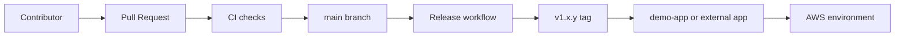

# Terraform AWS Modules - Mythos 5

A comprehensive collection of **34 modular Terraform configurations** for provisioning and managing AWS infrastructure. Each module is independently deployable and can be combined to create complete infrastructure solutions.

## Versioning

This repository uses semantic versioning. Release notes live under `releases/`, and the first stable tag is `v1.0.0`.

For public usage, start at [`docs/index.md`](C:/Users/ndayg/DSG-PROJECTS/terraform-modules-mythos-5/docs/index.md) or [`CONTRIBUTING.md`](C:/Users/ndayg/DSG-PROJECTS/terraform-modules-mythos-5/CONTRIBUTING.md) if you plan to change the repo.

[](https://github.com/gad0788/terraform-aws-modules-mythos/releases/tag/v1.0.0)
[](https://github.com/gad0788/terraform-aws-modules-mythos/actions/workflows/terraform-ci.yml)
[](https://github.com/gad0788/terraform-aws-modules-mythos/actions/workflows/checkov.yml)
[](https://github.com/gad0788/terraform-aws-modules-mythos/actions/workflows/release.yml)


## 📋 Table of Contents

- [Versioning](#versioning)
- [Quick Start](#quick-start)
- [Architecture](#architecture)
- [Modules Overview](#modules-overview)
- [Prerequisites](#prerequisites)
- [Project Structure](#project-structure)
- [Getting Started](#getting-started)
- [Module List](#module-list)
- [Usage Examples](#usage-examples)
- [Module Categories](#module-categories)

## 🎯 Modules Overview

### Base Infrastructure (10 modules)
The foundational services for building AWS infrastructure:

1. **VPC** - Virtual Private Cloud with public/private subnets, NAT gateways, and routing
2. **EC2** - Elastic Compute Cloud instances with security groups and EBS volumes
3. **EKS** - Managed Kubernetes cluster with worker nodes
4. **S3** - Simple Storage Service with versioning, encryption, and lifecycle policies
5. **RDS** - Relational Database Service (MySQL, PostgreSQL, etc.)
6. **IAM** - Identity and Access Management for roles, users, and policies
7. **Secrets** - AWS Secrets Manager for secure secret storage
8. **Keypair** - EC2 Key Pairs for SSH access
9. **EFS** - Elastic File System for shared storage
10. **EBS** - Elastic Block Storage volumes

### Networking & Load Balancing (5 modules)
Services for traffic management and DNS:

11. **ALB** - Application Load Balancer for HTTP/HTTPS traffic
12. **NLB** - Network Load Balancer for extreme performance
13. **Route53** - DNS service with health checks
14. **CloudFront** - Content Delivery Network (CDN)
15. **WAF** - Web Application Firewall for DDoS protection

### Compute & Orchestration (3 modules)
Additional compute services:

16. **Lambda** - Serverless compute functions
17. **Auto Scaling** - Automatic scaling groups with load balancing
18. **Batch** - Batch computing jobs with managed compute environment

### Data Services (3 modules)
Data storage and processing:

19. **ElastiCache** - In-memory caching (Redis/Memcached)
20. **DynamoDB** - NoSQL database
21. **OpenSearch** - Search and analytics engine

### Monitoring & Logging (3 modules)
Observability and compliance:

22. **CloudWatch** - Metrics, logs, and alarms
23. **CloudTrail** - API audit logging
24. **X-Ray** - Distributed tracing and debugging

### Container Registry (1 module)
Container image management:

25. **ECR** - Elastic Container Registry

### Security & Encryption (3 modules)
Encryption and certificate management:

26. **KMS** - Key Management Service
27. **ACM** - AWS Certificate Manager
28. **AWS Config** - Configuration compliance monitoring

### Application Services (5 modules)
Messaging and event-driven architectures:

29. **SNS** - Simple Notification Service (pub/sub)
30. **SQS** - Simple Queue Service (message queue)
31. **EventBridge** - Event routing and transformation
32. **Step Functions** - Serverless workflow orchestration

### Backup & Migration (2 modules)
Data protection and synchronization:

33. **AWS Backup** - Centralized backup management
34. **DataSync** - Automated data transfer

## 📦 Prerequisites

- **Terraform** >= 1.0
- **AWS Account** with appropriate credentials configured
- **AWS CLI** configured with credentials
- **Bash/Powershell** terminal

## 🗂️ Project Structure

```
terraform-modules-mythos-5/
├── main.tf              # Root module instantiation
├── variables.tf         # Root variables definitions
├── outputs.tf           # Root module outputs
├── terraform.tfvars     # Shared defaults
├── environments/
│   ├── README.md        # Environment usage guide
│   ├── dev/
│   │   └── terraform.tfvars   # Dev overrides and toggles
│   └── prod/
│       └── terraform.tfvars   # Prod overrides and toggles
├── README.md            # This file
└── modules/
    ├── vpc/             # VPC module
    ├── ec2/             # EC2 module
    ├── eks/             # EKS module
    ├── s3/              # S3 module
    ├── rds/             # RDS module
    ├── iam/             # IAM module
    ├── secrets/         # Secrets Manager module
    ├── keypair/         # Key Pair module
    ├── efs/             # EFS module
    ├── ebs/             # EBS module
    ├── alb/             # ALB module
    ├── nlb/             # NLB module
    ├── route53/         # Route53 module
    ├── cloudfront/      # CloudFront module
    ├── waf/             # WAF module
    ├── lambda/          # Lambda module
    ├── autoscaling/     # Auto Scaling module
    ├── batch/           # Batch module
    ├── elasticache/     # ElastiCache module
    ├── dynamodb/        # DynamoDB module
    ├── opensearch/      # OpenSearch module
    ├── cloudwatch/      # CloudWatch module
    ├── cloudtrail/      # CloudTrail module
    ├── xray/            # X-Ray module
    ├── ecr/             # ECR module
    ├── kms/             # KMS module
    ├── acm/             # ACM module
    ├── config/          # AWS Config module
    ├── sns/             # SNS module
    ├── sqs/             # SQS module
    ├── eventbridge/     # EventBridge module
    ├── stepfunctions/   # Step Functions module
    ├── backup/          # AWS Backup module
    └── datasync/        # DataSync module
```

Each module contains:
- `main.tf` - Resource definitions
- `variables.tf` - Input variables
- `outputs.tf` - Output values

## 🚀 Getting Started

### 1. Clone/Navigate to the Project

```bash
cd terraform-modules-mythos-5
```

### 2. Initialize Terraform

```bash
terraform init
```

### 3. Review Configuration

Edit `environments/dev/terraform.tfvars` or `environments/prod/terraform.tfvars` to customize your infrastructure:

```hcl
environment = "dev"

# Flip any module toggle on or off as needed
create_ec2 = true
create_rds = false
```

### 4. Plan Deployment

```bash
terraform plan -var-file="environments/dev/terraform.tfvars"
```

### 5. Apply Configuration

```bash
terraform apply -var-file="environments/dev/terraform.tfvars"
```

### 6. Get Outputs

```bash
terraform output
```

## 📚 Module List

| # | Module | Purpose |
|---|--------|---------|
| 1 | VPC | Virtual network infrastructure |
| 2 | EC2 | Compute instances |
| 3 | EKS | Kubernetes cluster |
| 4 | S3 | Object storage |
| 5 | RDS | Managed database |
| 6 | IAM | Access management |
| 7 | Secrets | Secret management |
| 8 | Keypair | SSH keys |
| 9 | EFS | Shared file storage |
| 10 | EBS | Block storage volumes |
| 11 | ALB | Application load balancing |
| 12 | NLB | Network load balancing |
| 13 | Route53 | DNS service |
| 14 | CloudFront | Content delivery |
| 15 | WAF | Web protection |
| 16 | Lambda | Serverless functions |
| 17 | Auto Scaling | Automatic scaling |
| 18 | Batch | Batch computing |
| 19 | ElastiCache | In-memory cache |
| 20 | DynamoDB | NoSQL database |
| 21 | OpenSearch | Search engine |
| 22 | CloudWatch | Monitoring |
| 23 | CloudTrail | API auditing |
| 24 | X-Ray | Tracing |
| 25 | ECR | Container registry |
| 26 | KMS | Key management |
| 27 | ACM | SSL certificates |
| 28 | AWS Config | Configuration management |
| 29 | SNS | Pub/sub messaging |
| 30 | SQS | Message queue |
| 31 | EventBridge | Event routing |
| 32 | Step Functions | Workflow orchestration |
| 33 | AWS Backup | Backup management |
| 34 | DataSync | Data synchronization |

## 💡 Usage Examples

### Example 1: Simple Web Server

```hcl
create_ec2  = true
create_alb  = true
create_rds  = true

# In terraform.tfvars
ec2_instance_type   = "t3.micro"
ec2_instance_count  = 2
alb_name            = "web-alb"
rds_engine          = "mysql"
```

### Example 2: Serverless Application

```hcl
create_lambda      = true
create_dynamodb    = true
create_sqs         = true
create_eventbridge = true
create_sns         = true
```

### Example 3: Kubernetes Cluster

```hcl
create_eks  = true
create_ecr  = true
create_kms  = true
```

### Example 4: Data Analytics Stack

```hcl
create_opensearch = true
create_dynamodb   = true
create_s3         = true
create_cloudwatch = true
create_datasync   = true
```

## 🔧 Module Categories

### Tier 1: Foundation
Always create these first:
- VPC
- IAM

### Tier 2: Compute
Choose based on your needs:
- EC2
- EKS
- Lambda
- Batch

### Tier 3: Data
Select appropriate services:
- S3
- RDS
- DynamoDB
- ElastiCache
- OpenSearch

### Tier 4: Networking
Add based on requirements:
- ALB/NLB
- Route53
- CloudFront
- WAF

### Tier 5: Operations
Essential for production:
- CloudWatch
- CloudTrail
- X-Ray
- AWS Backup

### Tier 6: Integration
For advanced workflows:
- SNS
- SQS
- EventBridge
- Step Functions

## 📖 Common Configurations

### Enable All Modules

```hcl
# In the environment tfvars file, set any create_* variables to true
```

### Production Setup

```hcl
environment = "production"

create_eks = true
create_rds = true
create_s3 = true
create_cloudwatch = true
create_cloudtrail = true
create_kms = true
create_backup = true
```

## 🔐 Security Best Practices

1. **Never commit credentials** - Use AWS profiles or environment variables
2. **Enable encryption** - All modules support encryption
3. **Use IAM roles** - Don't use root AWS credentials
4. **Enable audit logging** - Use CloudTrail and CloudWatch
5. **Backup important data** - Use AWS Backup module
6. **Restrict access** - Use security groups and Network ACLs

## 🆘 Troubleshooting

### Issue: "Error: AWS credentials not configured"
**Solution:** Configure AWS CLI credentials:
```bash
aws configure
```

### Issue: "Error: Resource limit exceeded"
**Solution:** Check service quotas in AWS Console and request increase if needed

### Issue: "State lock error"
**Solution:** Check for running Terraform processes and remove lock file if safe:
```bash
terraform force-unlock <LOCK_ID>
```

## 📝 License

These modules are provided as-is for educational and production use.

## 🤝 Contributing

To improve these modules:
1. Test changes thoroughly
2. Maintain backward compatibility
3. Document new variables
4. Follow Terraform best practices

## 📧 Support

For issues or questions:
- Check Terraform documentation: https://www.terraform.io/docs
- Review AWS documentation: https://docs.aws.amazon.com
- Check module-specific README files

## 🎓 Learning Resources

- [Terraform AWS Provider Documentation](https://registry.terraform.io/providers/hashicorp/aws/latest/docs)
- [AWS Well-Architected Framework](https://aws.amazon.com/architecture/well-architected/)
- [Terraform Best Practices](https://www.terraform.io/docs/cloud/guides/recommended-practices.html)

---

**Last Updated:** 2024
**Terraform Version:** >= 1.0
**AWS Provider Version:** >= 5.0

## Quick Start

For a first run, use the root defaults:

```bash
terraform init
terraform plan -var-file="terraform.tfvars"
terraform apply -var-file="terraform.tfvars"
```

For dev or prod, use the matching overlay and swap `dev` for `prod` as needed:

```bash
terraform plan -var-file="environments/dev/terraform.tfvars"
terraform apply -var-file="environments/dev/terraform.tfvars"
```

Docs index: [docs/index.md](C:/Users/ndayg/DSG-PROJECTS/terraform-modules-mythos-5/docs/index.md)

## Architecture




