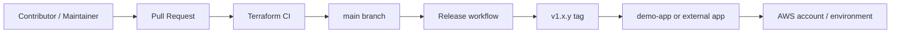

# Architecture

This repository is a Terraform module catalog that is consumed by other repos.

## High-Level Flow

## Layers

- **Root module**: orchestrates all optional AWS modules with `create_*` toggles.
- **`modules/`**: contains the reusable service modules.
- **`demo-app/`**: shows how a consumer pins a release and sets environment values.
- **`environments/`**: stores dev and prod tfvars overlays.
- **`.github/workflows/`**: runs validation, security scans, and releases.

## Release Pattern

1. A change lands in a feature branch.
2. The PR workflow runs validation and security checks.
3. The branch merges to `main`.
4. The release workflow tags the repo and publishes the GitHub release.
5. Consumers update the version reference when they are ready.
